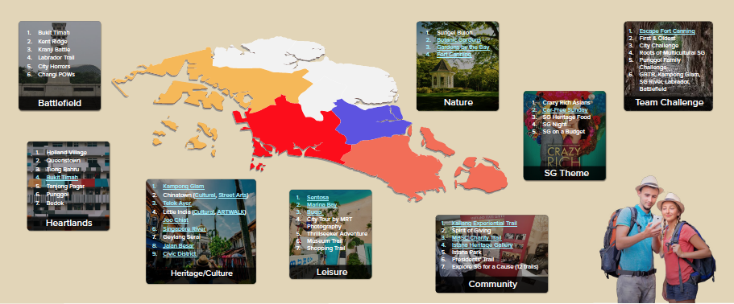
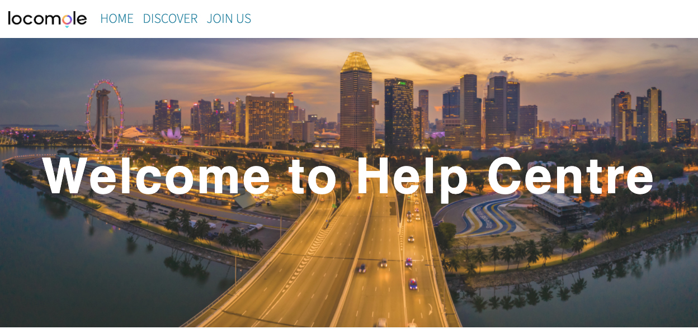
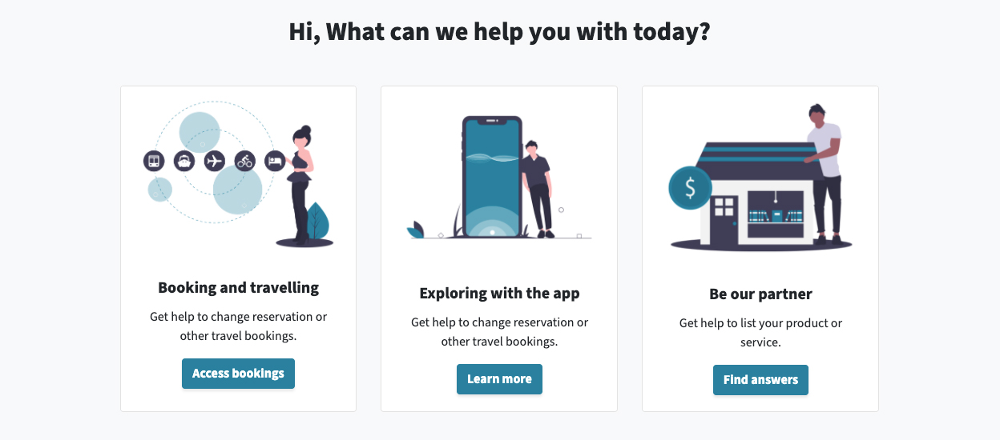
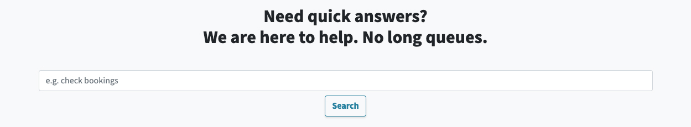
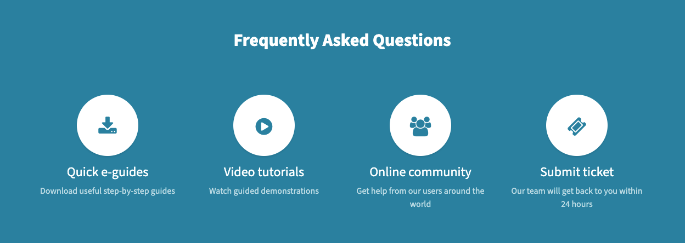
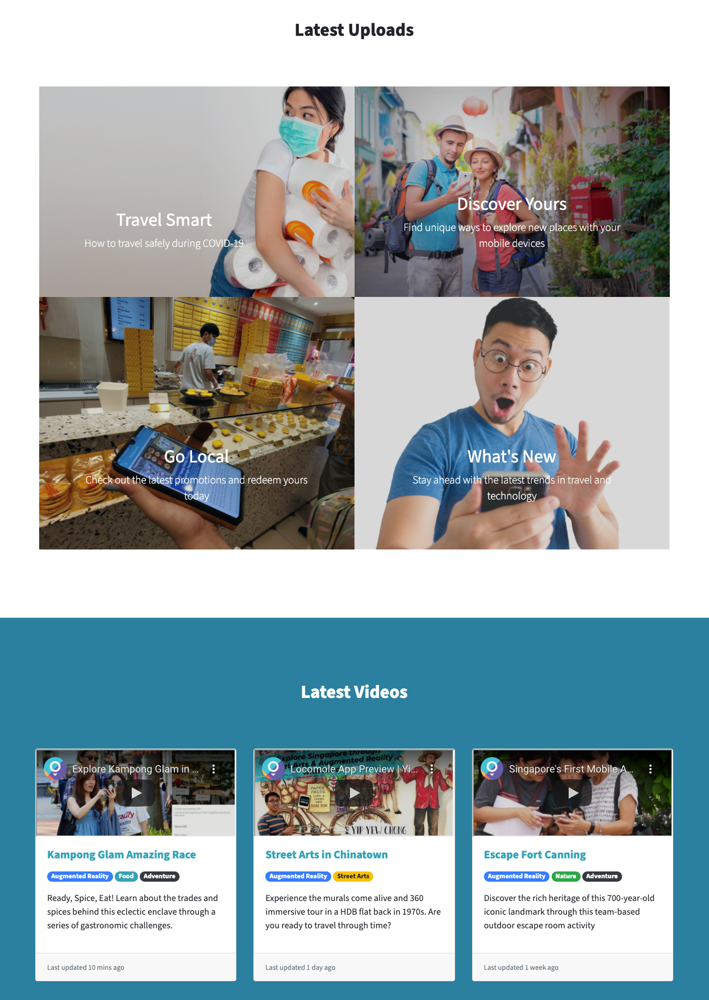
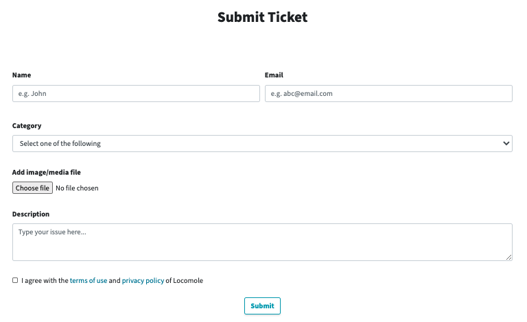
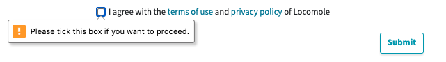
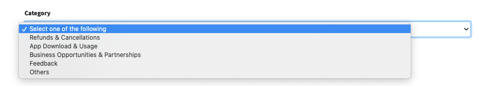
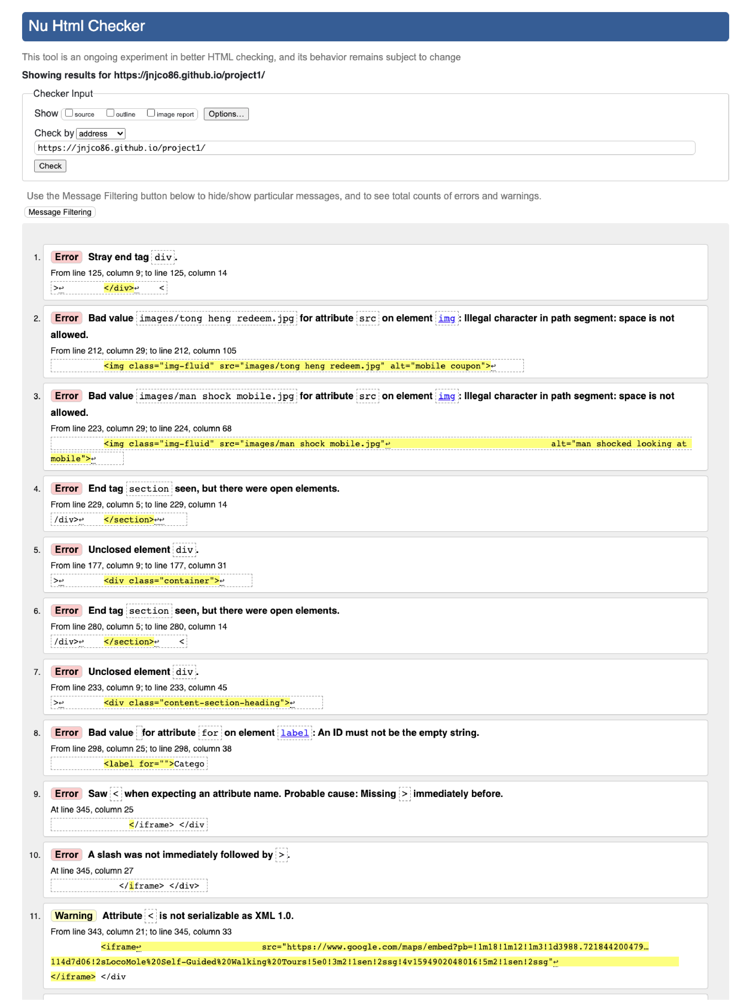

#Welcome to Locomole Help Centre

[TOC]

<!-- @import "[TOC]" {cmd="toc" depthFrom=1 depthTo=6 orderedList=false} -->

<!-- code_chunk_output -->

- [**Overview**](#overview)
- [**Objective**](#objective)
- [**Target Audience**](#target-audience)
- [**Problem Statement**](#problem-statement)
- [**UX Design Approach**](#ux-design-approach)
- [**Design for Accessibility**](#design-for-accessibility)
- [**Testing Conducted**](#testing-conducted)

<!-- /code_chunk_output -->

- [**Overview**](#overview)
- [**Objective**](#objective)
- [**Target Audience**](#target-audience)
- [**Problem Statement**](#problem-statement)
- [**UX Design Approach**](#ux-design-approach)
- [**Design for Accessibility**](#design-for-accessibility)
- [**Testing Conducted**](#testing-conducted)

## **Overview**

Screen recording of the entire website

<iframe width="560" height="315" src="https://www.youtube.com/embed/JhLuK-DOb3I" frameborder="0"></iframe>

## **Objective**

To set up an help centre for a local travel experiential augmented reality (AR) mobile app, Locomole. 

## **Target Audience**

1. Users who have made bookings/purchases from Locomole
2. Locals and travellers to explore and discover Singapore
3. Existing and prospective partners and merchants 

## **Problem Statement**

To have a one-stop service to cater for all our users, B2B, B2B2C and B2C segments. 

## **UX Design Approach**
Based on our heatmap study of interactions on our existing website, the most interactions were at the top nav bar.

Key design consideration is to allow users to find help based on their persona needs and allow users the fastest way to search for solutions. 

- [x] The search function was not at the navigation bar for 2 key reasons. (1) When the nav bar collapses as the screen size reduces, adding search which brings up the keypad on mobile devices will be confusing for users (2) Users will need some context to know what or how they should search

- [x] Brand consistency and personality were part of the design and the tone of the website. The images used are impactful and have a subtle meaning. Like the image within the hero section gives users the sense of direction (together with the nav bar) in depicting Singapore with multiple roads that represents the help channels for this website.

- [x] Create a **clear visual hierarchy** that relies on prominence (alternate colour segment for each section), grouping (header with sub-text, use of badges, to provide cues)

- [x] Stick to **conventions** for user familiarity and learnability

- [x] **Make obvious what is clickable** on a page, and break up pages into clearly defined areas.

**User-Centric Needs**

- [x] To meet the needs of users coming to this website, I have grouped them according to the **user personas**. The secondary text were based on the most keyword searches on our corporate website. As a user, this design would provide them a context and familiar terms they can use if they choose to use the search function. 

**Search Function**
- [x] The design of the search bar integrates the brand personality that connects with users by creative copywriting that resonates with the users' pain point in waiting to get answers as well as the literal design of a long search bar.

**Help Resources**
- [x] Most users are self-sufficient in terms of getting help. Those who are more tech-savvy will be able to leverage on digital resources that cater to a wide range of users. From those who are on-the-go, they can download e-guides. Those who require more guided assistance may choose to watch demo videos or get help from our community of users which is the company's long-term objective in creating a community besides on social media. 
  
- [x] This page will be further developed with links to the knowledge base consisting of e-guides, infographics, youtube channel videos, etc. 

**User Search to Engagement**
- [x] Based on our web analytics of the corporate website, visitors tend to scroll through content up till half the page. The rest of the website is designed with the objective to generate interest from users. 
- [x] Further development would be to integrate into the corporate website and use tracking for the user interaction with the various elements of the website to assess the overall design effectiveness

  
**Support form design consideration**:

- [x] Based on data-protection by design, the support form only collects necessary and relevant personal information as well as asking users for consent through a deliberate action    

- [x] Direct the issue to the right department

- [x] Included the option for user to add screenshot, especially when there are error messages or app crashes

## **Design for Accessibility**

Modern versions of assistive technologies will announce CSS generated content, as well as specific Unicode characters. To avoid unintended and confusing output in screen readers (particularly when icons are used purely for decoration), we hide them with the aria-hidden="true" attribute.

In order for assistive technologies (such as screen readers) to convey that a series of buttons is grouped, an appropriate role attribute needs to be provided. For button groups, this would be role="group", while toolbars should have a role="toolbar".

## **Testing Conducted**

**Unit level testing**

As part of testing, it was conducted at unit level. Visual Studio has built-in support for unit testing. I also utilised third party like validator.w3.org to assess my codes. 

- [x] organisation of my codes can be further improved, especially the < div > tags
- [x] proper assignment of values for attributes can lead to improve user experience (autocomplete for field input) or improve accessibility using aria-label etc. 

**Non-functional testing**

As this layout is significantly different from my company's existing website, I wanted to do a usability test to assess the non-functional aspects of the website. I also ran some 5-seconds impression tests to understand whether users can recall the objective of the website.

- [x] To consider reducing the hero header section so that the contents can be above the fold for desktop view 
- [x] Overall, the website was well-received and effective in meeting the objectives. 

